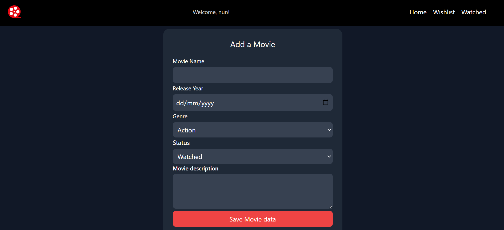

# CineTrack

## Project Description
CineTrack is a web app that helps users to keep track of movies and TV shows you want to watch, are watching, or have already seen. 

## Live Project
You can view the live web project here: [Live CineTrack Website](https://studentdev-glitch.github.io/CineTrack/)

## Features
-  **Track Movies & TV Shows** – Keep track of what you've watched and what you plan to watch.
-  Watchlist Management – Add, remove, and mark movies as watched.
-  Local Storage Support – Saves data to the browser so you don’t lose your watchlist.
-  Modern UI with Tailwind CSS – A clean, responsive user friendly ui design.
-  Animations with GSAP & Lottie – smooth modern animatied background implemented through cdn of the gsap and lottie

## How to Use
### Step 1: Open the Web App
1. Use the navigation link provided in this README.
2. Clone the Git repository to your local machine and use your favorite IDE to run it in a browser.

### Step 2: Add a Movie to the Watchlist
1. Fill out the form with the following details:
    - **Movie Name**: Enter the name of the movie (e.g., *Mr. Robot*).
    - **Release Year**: Enter the release year (e.g., *2015*).
    - **Genre**: Enter the genre (e.g., *Crime, Drama, Thriller*).
    - **Status**: Enter the status (e.g., *Watched, To Watch*).
    - **Description**: Provide a brief description (e.g., *Elliot, a cybersecurity engineer and hacker, is recruited by an underground hacker group called fsociety to take down a corrupt corporation while struggling with his own psychological issues*).
2. Click the **Save Movie** button to add the movie to your watchlist.



### Step 3: View the Watchlist
1. Once you have added movies, you can view them in the watchlist section or watched.
2. The watchlist displays the movies you have added with options to mark them as watched.


### Step 4: Mark a Movie as Watched
1. To mark a movie as watched, click the **Mark as Watched** button next to the movie.
2. The movie will be moved to the watched list and removed from the watchlist.

## Installation
To run this project locally, follow these steps:

1. **Clone the repository:**
    ```sh
    git clone https://github.com/studentdev-glitch/CineTrack.git
    ```
2. **Navigate to the project directory:**
    ```sh
    cd CineTrack
    ```
3. **Open index.html in your browser** through the IDE

## Behavior-Driven Development (BDD)
#### Feature: Track Movies & TV Shows
As a user, I want to keep track of movies and TV shows I have watched, am watching, or plan to watch, so that I can easily manage my watchlist.

##### Scenario: Add a movie to the watchlist
- **Given** I am on the homepage
- **When** I fill out the form with the required details and submit
- **Then** the movie should be added to my watchlist and saved in local storage

##### Scenario: Mark a movie as watched
- **Given** I have a movie in my watchlist
- **When** I click the "Mark as Watched" button
- **Then** the movie should be marked as watched and updated in local storage

##### Scenario: Delete a movie from the watched list
- **Given** I have a movie in my watched list
- **When** I click the "Delete" button
- **Then** the movie should be removed from local storage

## Technologies Used
- **HTML5** – Structuring the web app
- **CSS3** – Styling ui html structure
- **JavaScript (ES6)** – performing functions such as adding movie metadata to the local storage
- **Git** – Version control
- **Visual Studio Code** – Development environment
- **Tailwind CSS** – styling ui html structure
- **GSAP Animation** – High-performance animations
- **Lottie Animation** – Rendering animations

## Developer Information
**Author:** Louis Maina  
**GitHub:** [studentdev-glitch](https://github.com/studentdev-glitch)  
**Email:** louis.maina@student.moringaschool.com

## Contributing
Contributions are welcome! To contribute:

1. **Fork the repository**
2. **Create a new branch:**
    ```sh
    git checkout -b feature-branch
    ```
3. **Make your changes**
4. **Commit your changes:**
    ```sh
    git commit -am 'Add new feature'
    ```
5. **Push to the branch:**
    ```sh
    git push origin feature-branch
    ```
6. **Open a pull request**

## License Information
This project is licensed under the **MIT License**.

### Permissions
- Modify and use the code for personal and educational projects.
- Fork and contribute to the project.

###  Restrictions
- use of the code for commercial purposes
- Removal of copyright notice

**Contact for permissions:**  
- **GitHub:** [studentdev-glitch](https://github.com/studentdev-glitch)  
- **Email:** louis.maina@student.moringaschool.com  

© 2025 Louis Maina. All Rights Reserved.
